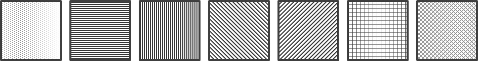

# blocks 패키지 사용법

다른 패키지에서는 `blocks` 폴더에 있는 공개 클래스와 enum을 사용합니다.

## BlockFactory.java

- `BlockFactory.createRandomBlock()`
  - 무작위 블록 하나를 생성합니다.

```java
Block block = BlockFactory.createRandomBlock();
```

## Block.java

- `getType()` : 블록 종류를 반환합니다.
- `getShape()` : 현재 블록 모양을 2차원 배열로 반환합니다.
- `getWidth()`, `getHeight()` : 현재 블록의 너비와 높이를 반환합니다.
- `getX()`, `getY()` : 현재 위치를 반환합니다.
- `setX(int)`, `setY(int)` : 현재 위치를 변경합니다.

```java
BlockType type = block.getType();
int[][] shape = block.getShape();

block.setX(4);
block.setY(0);
```

## BlockType.java

- `getValue()` : 블록 종류를 보드 저장용 숫자 `1~7`로 변환합니다.
- `BlockType.fromValue(int)` : 보드의 숫자 `1~7`을 `BlockType`으로 변환합니다.

```java
int boardValue = block.getType().getValue();
BlockType type = BlockType.fromValue(boardValue);
```

## ColorMode.java

현재 선택된 색상 모드를 나타냅니다.

```java
ColorMode.NORMAL
ColorMode.PROTANOPIA
ColorMode.DEUTERANOPIA
ColorMode.TRITANOPIA
```

## BlockStyle.java

`BlockStyle`은 블록 종류(`BlockType`)와 색상 모드(`ColorMode`)에 따라
렌더링에 사용할 색상과 패턴 정보를 제공합니다.

> ⚠️ `pattern`은 현재 **패턴의 종류만 정의된 상태**입니다.  
> `HORIZONTAL`, `DOT`, `GRID` 등의 값은 패턴의 의미만 나타내며,
> 선의 굵기, 간격, 점의 크기, 패턴 색상과 같은 실제 시각적 표현 방식은
> UI/Renderer에서 구현해야 합니다.

### Pattern Reference



### 제공 메서드

- `BlockStyle.of(BlockType, ColorMode)`
  - 블록 종류와 색상 모드에 맞는 `BlockStyle`을 반환합니다.
- `getColor()`
  - 렌더링에 사용할 색상을 반환합니다.
- `getPattern()`
  - 렌더링에 사용할 패턴 종류를 반환합니다.

### 보드에 저장된 블록의 스타일 가져오기

```java
BlockType type = BlockType.fromValue(cellValue);
BlockStyle style = BlockStyle.of(type, currentColorMode);

Color color = style.getColor();
BlockPattern pattern = style.getPattern();
현재 떨어지고 있는 블록의 스타일 가져오기


// 떨어지는 블록은 보드 값으로 변환하지 않고 BlockType을 직접 사용할 수 있습니다.
BlockStyle style = BlockStyle.of(block.getType(),currentColorMode);
```