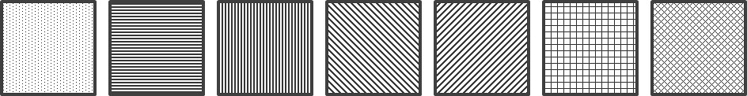

# blocks 패키지 사용법

다른 패키지에서는 `blocks` 폴더에 있는 공개 클래스와 enum을 사용합니다.

## BlockFactory.java

- `BlockFactory.createRandomBlock()`
  - NORMAL 확률로 무작위 테트로미노 하나를 생성합니다. 기존 호출과 호환됩니다.
- `BlockFactory.createRandomBlock(Difficulty difficulty)`
  - 난이도에 맞는 가중치로 테트로미노 하나를 생성합니다.
  - `difficulty`가 `null`이면 `NullPointerException`을 던집니다.

```java
Block block = BlockFactory.createRandomBlock();
```

### 난이도와 가중치 (FR-27)

`difficulty.Difficulty`는 공용 enum입니다. 게임 진행 레벨과는 별개입니다.

```java
import difficulty.Difficulty;

Block easyBlock = BlockFactory.createRandomBlock(Difficulty.EASY);
Block normalBlock = BlockFactory.createRandomBlock(Difficulty.NORMAL);
Block hardBlock = BlockFactory.createRandomBlock(Difficulty.HARD);
```

| 난이도 | I 가중치 | 나머지 6종 각 가중치 | I 확률 | 나머지 각 확률 |
| --- | --- | --- | --- | --- |
| EASY | 12 | 10 | 12/72 = 약 16.67% | 10/72 = 약 13.89% |
| NORMAL | 10 | 10 | 10/70 = 약 14.29% | 10/70 = 약 14.29% |
| HARD | 8 | 10 | 8/68 = 약 11.76% | 10/68 = 약 14.71% |

Requirements 2, 4쪽의 I 가중치 10→12 예시에 따라 상대 가중치를 조절합니다.
I의 최종 확률을 NORMAL 확률에 단순히 1.2 또는 0.8을 곱해 정하는 방식이 아닙니다.
확률은 해당 블록 가중치를 전체 가중치 합으로 나눈 값입니다.

### Stochastic Acceptance

1. I/O/T/S/Z/J/L 중 후보 하나를 동일한 확률로 선택합니다.
2. 후보 가중치 / 최대 가중치 확률로 수락합니다.
3. 거절하면 1단계부터 다시 시작하며 후보를 새로 뽑습니다.
4. 수락한 타입의 새 블록 객체를 생성합니다.

EASY의 최대 가중치는 12, NORMAL/HARD의 최대 가중치는 10입니다.
선택과 객체 생성을 Factory 내부에서 분리하여, 이후 아이템 생성에서도
`createRandomBlock(difficulty)`로 생성한 원본 블록을 재사용할 수 있습니다.
7-bag 방식은 사용하지 않습니다.

참고: Adam Lipowski, Dorota Lipowska,
[Roulette-wheel selection via stochastic acceptance](https://arxiv.org/abs/1109.3627),
Physica A 391 (2012), 2193–2196, II절.

## Block.java

- `getType()` : 블록 종류를 반환합니다.
- `getShape()` : 현재 블록 모양을 2차원 배열로 반환합니다.
- `getWidth()`, `getHeight()` : 현재 블록의 너비와 높이를 반환합니다.
- `getX()`, `getY()` : 현재 위치를 반환합니다.
- `setX(int)`, `setY(int)` : 현재 위치를 변경합니다.

```java
BlockType type = block.getType();
int[][] shape = block.getShape();

block.setX(4);
block.setY(0);
```

## BlockType.java

- `getValue()` : 블록 종류를 타입 값 `1~10`로 변환합니다.
- `BlockType.fromValue(int)` : 타입 값 `1~10`을 `BlockType`으로 변환합니다.

```java
int boardValue = block.getType().getValue();
BlockType type = BlockType.fromValue(boardValue);
```

일반 블록은 `1~7`, LINE_CLEAR는 `8`, WEIGHT는 `9`, BOMB는 `10`입니다.
아이템 문자까지 저장된 값은 `ui.ItemAppearanceResolver.fromBoardCell()`로 읽습니다.

## ColorMode.java

현재 선택된 색상 모드를 나타냅니다.

```java
ColorMode.NORMAL
ColorMode.PROTANOPIA
ColorMode.DEUTERANOPIA
ColorMode.TRITANOPIA
```

## BlockStyle.java

`BlockStyle`은 블록 종류(`BlockType`)와 색상 모드(`ColorMode`)에 따라
렌더링에 사용할 색상과 패턴 정보를 제공합니다.

> ⚠️ `pattern`은 현재 **패턴의 종류만 정의된 상태**입니다.  
> `HORIZONTAL`, `DOT`, `GRID` 등의 값은 패턴의 의미만 나타내며,
> 선의 굵기, 간격, 점의 크기, 패턴 색상과 같은 실제 시각적 표현 방식은
> UI/Renderer에서 구현해야 합니다.

### Pattern Reference



### 제공 메서드

- `BlockStyle.of(BlockType, ColorMode)`
  - 블록 종류와 색상 모드에 맞는 `BlockStyle`을 반환합니다.
- `getColor()`
  - 렌더링에 사용할 색상을 반환합니다.
- `getPattern()`
  - 렌더링에 사용할 패턴 종류를 반환합니다.

### 보드에 저장된 블록의 스타일 가져오기

```java
BlockType type = BlockType.fromValue(cellValue);
BlockStyle style = BlockStyle.of(type, currentColorMode);

Color color = style.getColor();
BlockPattern pattern = style.getPattern();
```

현재 떨어지고 있는 블록의 스타일 가져오기

```java
// 떨어지는 블록은 보드 값으로 변환하지 않고 BlockType을 직접 사용할 수 있습니다.
BlockStyle style = BlockStyle.of(block.getType(),currentColorMode);
```

## 아이템 생성

- `createItem(ItemType)` : 지정한 종류의 아이템을 생성합니다. 기본 난이도는 NORMAL입니다.
- `createItem(ItemType, Difficulty)` : 지정한 종류·난이도로 아이템을 생성합니다.

```java
Block bomb = BlockFactory.createItem(ItemType.BOMB);
Block bonus = BlockFactory.createItem(ItemType.BONUS, Difficulty.HARD);
```

`ItemType`은 아이템 종류, `BlockType`은 블록 모양·스타일 타입입니다.
통합 생성 API의 반환형은 `Block`입니다. 아이템 전용 메서드가 필요하면 실제 클래스를 확인합니다.
기존 개별 생성 메서드와 랜덤 생성 메서드도 그대로 사용할 수 있습니다.

- `createRandomItem()` : 등록된 아이템 중 하나를 생성합니다. 기본 난이도는 NORMAL입니다.
- `createRandomItem(Difficulty)` : 지정한 난이도로 아이템을 생성합니다.
- `createRandomLineClearItem(Difficulty)` : 일반 블록의 채워진 칸 하나에 L을 붙입니다.
- `createRandomBonusItem(Difficulty)` : 일반 블록의 채워진 칸 하나에 P를 붙입니다.
- `createBombItem()` : 1×1 Bomb을 생성합니다.

```java
Block item = BlockFactory.createRandomItem(Difficulty.HARD);
BombItem bomb = BlockFactory.createBombItem();
BonusItem bonus = BlockFactory.createRandomBonusItem(Difficulty.HARD);
```

인자 없는 API는 NORMAL입니다. L의 원본 테트로미노는 `Difficulty`별 확률로 생성하고,
실제로 채워진 칸 중 하나를 균등하게 골라 LineClearItem 생성자에 전달합니다.
Weight 모양과 효과는 대운이의 WeightItem을 그대로 사용합니다.

### 표시

- L: getSourceType()의 색맹 색상·기존 패턴 유지. isMarkerCell()인 한 칸에만 L 표시.
- Weight: 모든 색상 모드에서 은회색(#C8CDD3), 전용 BRICK 패턴, 채워진 칸마다 W 표시.
- 게임 화면과 NEXT는 BlockRenderer.drawBlockCell()을 공유합니다.
- 문자는 대비되는 외곽선을 사용하며 Graphics2D의 변경은 복제 객체 안에서 처리합니다.
- BlockType 값은 기존 I/O/T/S/Z/J/L=1~7을 유지하고 LINE_CLEAR=8, WEIGHT=9를 추가합니다.
  일반 블록 생성 후보는 계속 7종만 포함합니다.

### 새 부착형 아이템 추가

LineClearItem/WeightItem에 표시 인터페이스를 추가하지 않습니다.
ItemRegistry에 클래스·생성 함수·표시 정보를 게임 시작 전에 한 번 등록합니다.
동일한 id 또는 클래스의 중복 등록은 오류이며, 등록된 정확한 클래스에 표시가 적용됩니다.
생성 후보에 등록하면 즉시 랜덤 생성 대상이 되므로 효과까지 준비된 클래스만 등록하세요.

아래는 미래에 팀이 BombItem을 구현한 후의 예시입니다. 현재 존재하는 클래스가 아닙니다.
생성자의 인자와 표시 메서드는 그때 확정된 실제 클래스에 맞춥니다.

```
ItemRegistry.register("bomb", BombItem.class,
    difficulty -> {
        Block source = BlockFactory.createRandomBlock(difficulty);
        int[] marker = BlockFactory.selectRandomOccupiedCell(source);
        return new BombItem(source, marker[0], marker[1]);
    },
    bomb -> new ItemAppearance(bomb.getSourceType(), 'B', bomb::isMarkerCell));
```

ItemAppearance는 배경 스타일·문자·표시 칸 판별을 보관합니다. 판별 함수는 현재 모양을
조회해야 회전 이후에도 표시가 따라갑니다. 위치 숫자를 초기값으로 고정하지 마세요.
같은 부착형이라면 Renderer/Preview 수정 없이 등록을 추가할 수 있습니다.
독립형 아이템은 모양 클래스와 BlockStyle의 전용 스타일도 추가해야 합니다.
등록은 생성·표시를 연결하며, 효과 발동을 자동으로 구현하지는 않습니다.
L과 Bonus의 원본 블록은 난이도별 확률로 생성합니다. 일반 블록 추첨 후보는 기존 7종입니다.

아이템 클래스·등록 방법은 [item 사용법](../item/item_ReadMe_for_dev.MD),
화면 표시·보드 값 변환은 [ui 사용법](../ui/ui_ReadMe_for_dev.MD)을 참고합니다.
